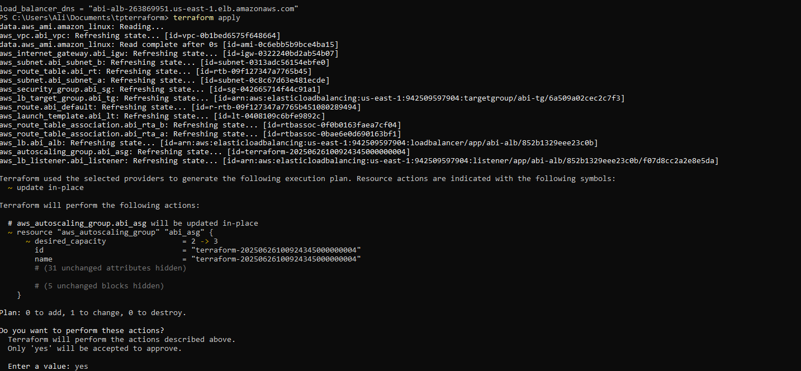

# TP Terraform

## Contenu des fichiers

mon script terraform ce comporte en 3 fichier 

### "main.tf"

ce fichier va contenir toute les création de notre infrastructure

- Région
- clé ssh
- security group
- internet gateway
- vpc
- l'auto scalling 
- les sous réseaux
- la table de route
- target group
- Application load balancer
- instance avec user_data

--------------------------

### "Variabled.tf"

ce fichier vas définir les variables utilisées dans "main.tf" comme la région , le type d'instance etc

ça évitera de ce perdre si jamais une valeur est fausse.

--------------------------

### "outputs.tf"

ce fichier va permettre d'afficher l'addresse DNS de notre serveur quand le terraform aura fini.

## Mise en place

Lors de l'installation du terraform faudra l'instauré dans le PATH de notre variable d'environnement.

pour savoir si terraform est bien instauré nous allons faire un `terraform -v` pour voir si il nous affiche ça version.

par la suite on lance dans le dossier ou ce trouve notre script

`terraform init`

puis un 

`terraform apply`

cela va montré tout les ajouts que va avoir notre AWS 

après ça on confirme le démarrage de notre script et par la suite le script va lancer les créations demandé dans le main.tf.

après que le script est pu ce finalisé , notre outputs va nous fournir notre lien vers le site web

et quand on va sur le lien et qu'on rafraichit notre site web nous montre l'id de différente instance (la 2 vu qu'on a configurer l'autoscalling a 2)

## Test

Pour faire ce teste nous allons mettre la capacité de notre autoscalling a 3 au lieu de 2.

après avoir fait ça nous allons refaire un `terraform apply`

et on peut remarqué avant de confirmer notre apply que la capacité de l'autoscalling va passer a 3

après les changements appliquer nous allons mettre faire pareil qu'au dessus et on remarque qu'il y a bien 3 instance ID qui apparaisse 

